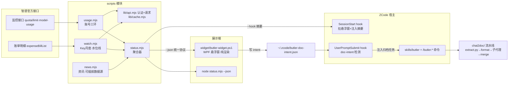

# zcode-butler(码管家)项目文档

> **文档性质:设计方案(施工图)** —— 开发前编写;开发中冻结,计划变更走《开发日志.md》新 ADR 条目。
> 版本:v0.1.0 首版设计 · 日期:2026-09-11 · 状态:**待开发**(实施计划见 §11)

---

## 1. 项目概述

zcode-butler(码管家)是一个 ZCode 插件,把四个独立能力收进一个"贴边管家":

| # | 功能 | 来源 | 一句话说明 |
|---|---|---|---|
| F1 | 账号用量 | 吸收自 zcode-usage v0.0.6 | 5 小时池 / 每周额度 / MCP 月度 / 当日模型用量,三环展示 |
| F2 | Key 监控 | 吸收自 zcode-watch v0.4.0 | 多把 GLM API Key 的自然月加权用量(高峰×3),渐进环展示 |
| F3 | 会话归档 Chat2Doc | 改写自 session-doc-prompt v1.1(opencode 专用) | 把 AI 编程会话转录加工成开发文档,流水线复用约 70% |
| F4 | 活动资讯 | 全新 | 智谱 / ZCode 专属信息,铃铛环 + 资讯面板 |

**关键约束(已与用户确认):**
- 三个源项目(zcode-usage / zcode-watch / session-doc-prompt)**继续独立存在、独立维护**,不因 butler 废弃。
- butler 内置各功能的**自带实现副本**(vendored);公共逻辑提炼进 `lib/`,后续源项目可反向对齐。

**参考项目本地路径(新会话实施时从这里取源码):**

| 项目 | 本地路径 | 用途 |
|---|---|---|
| zcode-usage v0.0.6 | `C:\Users\27844\Desktop\zcode-usage` | usage.mjs 移植源(skills/zcode-usage/scripts/zcode-usage.mjs) |
| zcode-watch v0.4.0 | `C:\Users\27844\Desktop\zcode-watch` | watch.mjs 移植源 + 悬浮窗链路参照 |
| session-doc-prompt v1.1 | `C:\Users\27844\Desktop\session-doc-prompt-main\session-doc-prompt-v1.1.md` | Chat2Doc 流水线/摘要规范/防护逻辑的原始蓝图 |

---

## 2. 需求与验收标准

### 2.1 功能需求

| 编号 | 需求 | 说明 |
|---|---|---|
| R1 | 账号三环 | 无论 API Key 登录还是智谱账号登录,悬浮窗固定显示三个环:⚡5h池 / 📆每周 / 🔌MCP月度;悬停左弹气泡(已用/总量/重置倒计时) |
| R2 | Key 渐进环 | 初始 1 个 Key 环(默认=用量占比最高那把),点击扩展环逐级 +1,上限 3 个;悬停气泡显示档位/重置日/高峰拆分 |
| R3 | 铃铛资讯环 | 红点=未读数;悬停预览最新 2 条;点击向左展开资讯面板(新=绿点/已读=灰/一键全读) |
| R4 | 设置小点 | 平时为 10px 小点,悬停弹出齿轮;点击齿轮左侧弹出折叠式配置卡(归档当前会话 / Key 管理 / 设置 / 隐藏悬浮窗) |
| R5 | Chat2Doc | 归档入口:悬浮窗齿轮菜单 + `/butler:doc` 命令 + 自然语言;**只做素材归档**——分批摘要后的结构化素材文档即为最终产物,不做二次成文(用户修订,见 D7);素材格式模板外置 `assets/templates/` |
| R6 | 四端一致 | 悬浮窗 / 斜杠命令 / 对话 skill / 终端 CLI 的数字必然一致(同一聚合数据源) |
| R7 | 会话入口 | `skills/butler`(自然语言)+ `/butler:usage` `/butler:watch` `/butler:doc` `/butler:news` 命令 + SessionStart hook(拉悬浮窗、注入摘要) |
| R8 | 收起把手 | 双击胶囊或拖至窗口缘 → 缩为右缘小把手;单击把手展开(参考 Nothing OS 侧边栏交互) |
| R9 | 跟随 ZCode 右缘 | 默认吸附 ZCode 主窗口右缘,WinEvent 钩子实时跟随(机制见 §4.4);ZCode 最小化→隐藏、关闭→退回屏幕右缘并低频重扫重吸附;`dock` 配置可切回贴屏幕右缘 |

### 2.2 验收标准(DoD)

- [ ] 账号三环数字与 zcode-usage v0.0.6 输出一致(交叉验证同 Key 同时刻)
- [ ] Key 月度数字与 zcode-watch v0.4.0 输出一致(交叉验证)
- [ ] 悬浮窗全部交互态可用:渐进环(1→2→3)、悬停气泡×4 种、小点↔齿轮、折叠菜单三组、资讯面板、收起把手、位置记忆、单实例互斥
- [ ] Chat2Doc 在 ≥2 个真实历史会话上产出可读素材文档(读者无需原始会话即可理解全貌)
- [ ] 聚合器单模块故障时其余模块正常(环灰显 `!`,不整体崩溃)
- [ ] 单元测试通过:加权/高峰拆分纯函数、rollout 解析器、format/merge 脚本、协议 schema
- [ ] `/butler:*` 四命令、skill 自然语言触发、SessionStart hook 注入均工作
- [ ] README 快速开始命令实测有效

---

## 3. 总体架构:模块化内核 + 单一聚合入口

### 3.1 架构图



### 3.2 插件资源形态

| 资源 | 内容 |
|---|---|
| `skills/butler/SKILL.md` | 主技能:自然语言入口;内嵌 Chat2Doc 流程与三套文档模板(复用 session-doc-prompt 的模板与摘要规范) |
| `commands/usage.md` `watch.md` `doc.md` `news.md` | 四个斜杠命令 |
| `hooks/hooks.json` | SessionStart:①`widget-launch.mjs` 拉起/唤醒悬浮窗 ②`status.mjs --hook` 注入一行摘要(三环+满额警告+未读资讯数);UserPromptSubmit:`doc-intent.mjs` 检测归档意图 |

### 3.3 四端一致原则

悬浮窗是**纯渲染壳**(不取数),与命令/对话/CLI 共用 `status.mjs --json` 单一数据源——沿用 zcode-watch 验证过的模式。

---

## 4. 悬浮窗 UI 设计定稿(Windows WPF 先行)

> 可交互 HTML 原型:`docs/ui/01-悬浮窗总览定稿.html`、`docs/ui/02-齿轮菜单折叠配置定稿.html`(浏览器打开即看)

### 4.1 平时态布局(自上而下)

```
┌ 胶囊(贴屏幕右缘,黑色圆角竖条,宽约 64px)┐
│  ⚡ 5h池环   3%   │  ← 大环 42px:中心线性图标+状态色进度弧+下方等宽百分比
│  📆 每周环   1%   │
│  🔌 MCP环    11%  │
│  ────── 分隔线 ──────  │
│  🔑 Key环#1  78   │  ← 小环 30px:初始 1 个(用量最高那把),带 ⊕ 徽标
│  🔑 Key环#2       │  ← 点击扩展环逐级 +1,上限 3 个(达到上限 ⊕ 消失)
│  ────── 分隔线 ──────  │
│  🔔 铃铛环   3条  │  ← 无进度弧;红点徽标=未读数
└──────────────┘
        ●  设置小点(10px,与胶囊分离,几乎隐形)
```

### 4.2 交互细则

| 交互 | 行为 |
|---|---|
| 悬停任意环 | 向左弹出详情气泡(带右向小箭头):5h池=已用/总量+重置倒计时;Key=档位/尾号脱敏/重置日/高峰·非高峰拆分;铃铛=最新 2 条预览+"点击查看全部";MCP=联网搜索/网页读取/Zread 明细 |
| 悬停设置小点 | 平滑展开为齿轮按钮(弹出动画);移开缩回小点 |
| 点击齿轮 | 左侧弹出折叠式配置卡(标题栏:红点+`BUTLER` 大字距+✕):三组折叠项+底部"隐藏悬浮窗";**同组同时只展开一个**,再点收起,点 ✕/外部关闭 |
| └ 归档当前会话 | 展开后:输出位置 + 「开始归档」(只收集素材成文档,见 §7)→ 写 intent 文件 |
| └ Key 管理 | 展开后:Key 卡列表(名称/档位/尾号/百分比/删除)+ 虚线"+ 添加 Key" |
| └ 设置 | 展开后:主题(跟随ZCode/深/浅)· 刷新频率 · 位置重置 · 开机自启 |
| 点击铃铛 | 左侧展开资讯面板:条目(绿点=新/灰=已读)+ 标题 + 日期·来源;底部"标记全部已读" |
| 双击胶囊 / 拖至边缘 | 缩为右缘小把手;单击把手展开 |
| 窗口跟随 | 默认吸附 ZCode 主窗口右缘外侧;ZCode 拖动时实时跟随(悬浮窗降为 60% 不透明度示意"吸附中",松手恢复);最小化隐藏、还原恢复;窗口不在时退回屏幕右缘(机制见 §4.4) |
| 右键胶囊 | 弹轻量快捷菜单(Windows 原生 ContextMenu):⟳立即刷新 / ▤收起为把手 / ▦隐藏悬浮窗 / ─── / ⚙打开码管家面板;与小点齿轮互补——右键管高频小动作,齿轮管配置 |
| 刷新 | 110 分钟定时 + wake 文件唤醒(新会话拉起)+ 手动;Ctrl+Shift+G 显隐(沿用) |

### 4.3 视觉规范

- 风格基调:Nothing OS 极简(参考用户提供的贴边胶囊图/视频)
- 图标:1.6px 线性 SVG(自带图标库,WPF 用 Path 重绘),装圆角"芯片"
- 数字/路径/尾号:等宽字体;状态变色:<50% 绿 `#7ef0b2` / 50-80% 黄 `#ffc861` / ≥80% 红 `#ff5f5f`;故障灰显 `!`
- 主题:跟随 ZCode 深浅色;位置记忆;单实例互斥量 + 唤醒文件(沿用 usage/watch 链路)

### 4.4 跟随 ZCode 右缘机制(R9)

吸附目标:默认 ZCode 主窗口右缘外侧 0px(窗口贴屏幕右缘/最大化时,与贴屏幕效果一致);`butler.json` 的 `dock: "zcode-right" | "screen-right"` 可切换。

| 方案 | 结论 |
|---|---|
| WinEvent 钩子:`SetWinEventHook(EVENT_OBJECT_LOCATIONCHANGE)` 订阅 ZCode 窗口移动/缩放 | ✅ **采用**:系统级推送、逐像素通知、零轮询开销;回调仅置脏标记,33ms DispatcherTimer 统一重定位(防抖防卡) |
| 定时轮询 `GetWindowRect`(100-200ms) | 备选降级:拖动有拖影;仅当钩子在 PowerShell 宿主下实测不稳时启用 |
| `SetParent` 挂成 ZCode 子窗口 | ❌ 否决:被子窗口裁剪在宿主客户区内;Chromium 宿主的合成/点击/z 序风险;失去独立置顶能力 |

配套细节:

- **pid 获取**:SessionStart hook 本身是 ZCode 子进程 → `widget-launch.mjs` 向上取父进程链拿到 ZCode pid 传给 .ps1(不猜进程名,不怕改名/多开);主窗口 = `EnumWindows` 该 pid 下最大可见顶层窗(绕开设置弹窗)
- **事件订阅**:加订 `EVENT_SYSTEM_MINIMIZESTART / RESTORE` —— 最小化隐藏悬浮窗,还原恢复
- **降级链**:ZCode 关闭/崩溃窗口消失 → 退回屏幕右缘(现行为),每 2-3s 低频重扫,窗口回归自动重吸附;悬浮窗永不"失踪"
- **位置记忆语义变更**:从绝对屏幕坐标改为**相对吸附缘的偏移量**(水平贴缘,垂直记 offsetY)
- **DPI**:PerMonitorV2 感知,`GetWindowRect` 与 WPF DIP 换算对齐(沿用位置记忆已有的处理)

---

## 5. 数据协议(`status.mjs --json`)

悬浮窗/命令/对话/CLI 唯一数据源。字段增删必须四端同步(见 AGENTS.md 红线)。

```jsonc
{
  "fetchedAt": "2026-09-11T01:00:00+08:00",
  "account": {                          // R1:三环(失败时对应字段为 null 并入 errors)
    "fiveHour":    { "pct": 3,  "used": 4072,    "limit": 125000, "resetAt": "...", "status": "ok" },
    "weekly":      { "pct": 1,  "used": "...",   "limit": "...",  "resetAt": "...", "status": "ok" },
    "mcpMonthly":  { "pct": 11, "tools": { "webSearch": "...", "webReader": "...", "zread": "..." }, "resetAt": "...", "status": "ok" },
    "peakNow": false                     // 高峰期(工作日14-18时)横幅提醒
  },
  "keys": [                              // R2:按 pct 降序;悬浮窗渐进环按序取前 N 个
    { "id": "k1", "name": "主力", "tier": "PRO", "tail": "A1B2",
      "pct": 42, "usedWeighted": 7.3e8, "quota": 17.5e8,
      "peak": 6.1e8, "offpeak": 2.6e8, "resetDate": "2026-09-30", "status": "ok" }
  ],
  "news": { "unread": 3, "latest": [ { "id": "n1", "title": "...", "date": "09-10", "source": "智谱开放平台", "level": "info" } ] },
  "errors": [ { "module": "watch", "message": "..." } ]   // 单模块降级记录
}
```

`--hook` 模式:读 ≤60 分钟缓存(零请求)输出 additionalContext 一行摘要;仅满额/高峰/有未读时注入。

---

## 6. 数据来源与取数策略

### 6.1 账号三环(沿用 zcode-usage v0.0.6 链路)

- `GET {origin}/api/monitor/usage/quota/limit` — 三环额度(unit=3 五小时池 / unit=6 每周 / TIME_LIMIT=MCP月度)
- 当日模型用量/工具调用接口照搬;高峰拆分用小时序列求和(工作日 14:00-17:59 左闭右开),不单独发峰窗区间请求
- 认证:`Authorization` 头,401 自动补 `Bearer`;超时 hook 5s / 常规 10s
- 凭证优先级:参数 → `ANTHROPIC_AUTH_TOKEN`/`ANTHROPIC_BASE_URL`(或 `ZAI_API_KEY`)→ 手动配置文件 → `~/.zcode/v2/config.json` 全 provider 扫描(编程套餐>通用>自定义);跳过 `zcode.z.ai`

### 6.2 Key 月度(沿用 zcode-watch v0.4.0 链路)

- `GET https://bigmodel.cn/api/finance/expenseBill/expenseBillList` — 分钟级账单,同账号多 Key 一次拉取各自拆分
- 加权口径:总使用 = 非高峰×1 + 高峰×3;自然月,每月 1 号重置
- 增量同步:水位线+缺口窗口(保底 2h)、小时桶幂等合并、40 页断点续拉;账号 customerId 去重 + keyMap 学习
- 配置文件格式兼容 zcode-watch(`~/.zcode/zcode-watch.json` 可直接导入 butler.json)

### 6.3 会话转录(Chat2Doc 新数据源,已实测探明)

- 位置:`~/.zcode/cli/rollout/model-io-sess_<会话ID>.jsonl`,一会话一文件(ZCode 3.11.2 实测)
- 每行一次模型调用转储:`request.body.messages` 为**全量对话快照**(user/assistant/tool/system 四角色;assistant 含 `tool_use` 块[工具名+完整参数];tool 角色含 `tool-result` 块[toolCallId+toolName+完整输出])
- 提取策略:取**最后一条含 messages 的主调用行**;过滤:标题生成调用(messages 为空/system 为标题任务)、`<system-reminder>` 注入块、thinking 块
- "当前会话" = `rollout/` 下最新修改的文件(正在活跃写入,尾部可能缺最后几条,可接受)

### 6.4 资讯(数据源**待定**,接口先行)

- `news.mjs` 数据源接口可插拔:`resolve() → [{id,title,date,source,level,url?,expiresAt?}]`
- 首期实现:`assets/news.json` 本地读取 + 官方渠道直达链接清单(README 挂链接)
- 二期可加远程源(URL/抓取器)而不改架构;**本期不实现抓取**

---

## 7. Chat2Doc 流水线设计(核心新代码)

### 7.1 流程

```mermaid
flowchart LR
    R[rollout JSONL] --> E[extract.py<br/>取最后主调用·过滤注入块<br/>→ 中间格式 turns.json]
    E --> F[format_batch.py<br/>按~150parts分批·不切断回合<br/>→ semi-N.md + hints-N.txt]
    F --> A[ZCode Agent 子代理<br/>后台并行·按类型摘要<br/>→ repl-N.txt]
    A --> M[merge_batch.py<br/>替换占位符·合并相似项<br/>→ 素材文档(最终产物)]
```

> **范围修订(用户确认):** 只做素材归档——分批摘要流水线照常跑,产出的结构化素材文档就是交付物;原版的"阶段二成文(开发日志/技术方案/开发体系三模板)"**不做**。素材文档的格式说明外置在 `assets/templates/素材文档.md`,想调结构直接改模板文件,不动技能代码(自定义口子:以后加新格式=加新模板文件)。

### 7.2 opencode → ZCode 移植对照

| 环节 | 原版(opencode) | butler(ZCode) | 复用度 |
|---|---|---|---|
| 会话读取 | SQLite 三表(session/message/part) | extract.py 读 rollout JSONL(§6.3) | **重写**(全新) |
| 回合分组/分批 | parentID 分组,~150 parts/批 | 相同逻辑,中间格式语义一致 | 高 |
| Markdown 防护 apply_guards | 降级#/---转*** | 原样复用 | 100% |
| 工具名/参数映射 | edit/read/bash/task(filePath…) | Edit/Read/Bash/Grep/Glob/Agent/TodoWrite(file_path…) | 改映射表 |
| 注入过滤 | system-reminder/search-mode… | `<system-reminder>`、标题生成、thinking | 调整 |
| 子代理派发 | task(category=deepseek/minimax 便宜模型交替) | ZCode Agent 工具(general-purpose,后台并行);无便宜模型 → 批调小+摘要规则更严 | 改写 |
| merge_batch.py | 纯文本合并 | 原样复用 | 100% |
| 素材文档格式+质量要求 | 内嵌 prompt | 提炼为 `assets/templates/素材文档.md`(外置可编辑) | 高(格式可调) |
| 断点续跑 | .progress.json + todowrite | 相同 | 高 |
| 平台 | Linux /root /tmp python3 | Windows %TEMP% py | 适配 |

### 7.3 触发链路(intent 文件 + hook 自动注入)

1. 悬浮窗「开始归档」→ 写 `~/.zcode/butler-doc-intent.json`:`{createdAt, docType, outputDir, sessionId?, materialOnly?}`
2. 用户下次在 ZCode 发任意消息 → **UserPromptSubmit hook**(`doc-intent.mjs`)检测到 intent → 注入归档任务上下文,模型执行 Chat2Doc → 执行后删除 intent
3. intent 带 10 分钟过期,防陈旧误触发
4. **兜底**:若 ZCode 不支持 UserPromptSubmit 事件 → 退化到 SessionStart 检测 + 悬浮窗同时复制 `/butler:doc` 命令到剪贴板提示粘贴

---

## 8. 文件与数据设计

| 文件 | 读写方 | 说明 |
|---|---|---|
| `~/.zcode/butler.json` | 人写/助手代管/悬浮窗 Key 管理 | Key 列表(兼容导入 zcode-watch.json)、悬浮窗设置(吸附模式 `dock: zcode-right\|screen-right`、相对偏移)、归档默认输出目录、资讯源配置 |
| `~/.zcode/butler-manual.json` | 人写/悬浮窗配置界面写入 | 手动凭证兜底(对应 zcode-usage-manual.json 的角色),三端共用 |
| `~/.zcode/butler-cache.json` | 机器生成,勿手改 | watch 水位线/小时桶、三环缓存、lastResult(hook 零请求用) |
| `~/.zcode/butler-news-read.json` | 机器生成 | 已读资讯 id 列表 |
| `~/.zcode/butler-doc-intent.json` | 悬浮窗写/hook 删 | 归档意图,10 分钟过期 |
| `plugins/zcode-butler/assets/news.json` | 人维护(插件更新分发) | 资讯条目 + 官方渠道链接清单 |
| 密钥安全 | — | Key 全程不进命令行参数(环境变量传递);一切输出脱敏为尾号 4 位 |

---

## 9. 组件设计

| 模块 | 职责 | 依赖 |
|---|---|---|
| `lib/api.mjs` | 智谱 API 客户端+认证+超时重试(usage/watch 共享) | — |
| `lib/cache.mjs` | 缓存读写、过期判断 | — |
| `lib/protocol.mjs` | §5 协议 schema 定义与校验 | — |
| `usage.mjs` | 账号三环+当日用量(提炼自 zcode-usage) | lib |
| `watch.mjs` | Key 月度+水位线增量(提炼自 zcode-watch) | lib |
| `news.mjs` | 资讯读取+已读管理(数据源可插拔) | — |
| `status.mjs` | 聚合器:`--json`/`--hook`/默认卡片;各模块独立 try/catch 降级 | 全部 |
| `chat2doc/extract.py` | rollout JSONL → turns.json 中间格式(新) | py3.10+ |
| `chat2doc/format_batch.py` `merge_batch.py` | 分批预处理/合并后处理(原版复用改映射) | py3.10+ |
| `widget/butler-widget.ps1` | WPF 悬浮窗**纯渲染壳**(§4 全部 UI,含 §4.4 窗口跟随) | status.mjs --json |
| `widget/widget-launch.mjs/.vbs` | 跨平台启动分发/免黑窗 + 向上取 ZCode pid 传递给悬浮窗(沿用) | — |
| `doc-intent.mjs` | UserPromptSubmit hook:检测并注入归档意图 | — |

---

## 10. 目录结构

```
zcode-butler/                          ← 仓库根(插件市场)
├── README.md / AGENTS.md / PROJECT.md / WIKI.md / 开发日志.md
├── marketplace.json (+ .zcode-plugin/ 副本)
├── docs/ui/                           ← UI 定稿原型(HTML)
└── plugins/zcode-butler/
    ├── .zcode-plugin/plugin.json      ← v0.1.0,声明 skills/commands/hooks
    ├── skills/butler/SKILL.md
    ├── commands/{usage,watch,doc,news}.md
    ├── hooks/hooks.json               ← SessionStart×2 + UserPromptSubmit×1
    ├── assets/news.json
    ├── scripts/
    │   ├── lib/{api,cache,protocol}.mjs
    │   ├── {usage,watch,news,status,doc-intent,widget-launch}.mjs
    │   ├── *.test.mjs                 ← node:test 内置,零依赖
    │   ├── chat2doc/{extract,format_batch,merge_batch}.py + *_test.py
    │   └── widget/{butler-widget.ps1, widget-launch.vbs}
    └── macos/                         ← 二期占位
```

---

## 11. 实施计划(里程碑,等用户命令后执行)

- [ ] **M1 数据内核**:`lib/` + usage/watch 移植 + status 聚合 + 协议 + 单测 → CLI 四端之一可用,与旧插件数字交叉验证
- [ ] **M2 悬浮窗**:WPF 新 UI(渐进环/气泡/小点齿轮/折叠卡/资讯面板/把手)+ §4.4 窗口跟随(WinEvent 首日实测)+ SessionStart hook 接入
- [ ] **M3 Chat2Doc**:extract.py → 流水线 → 素材文档(模板外置)→ `/butler:doc` + intent 触发链路(含 UserPromptSubmit 实测)
- [ ] **M4 资讯+收尾**:news.mjs + 铃铛/资讯面板数据 + README/截图/发布

依赖关系:M1→M2 硬依赖;M3、M4 可与 M2 并行。

### 可选增强(Backlog,按需排期,不在 M1-M4 内)

- **Toast 系统通知**:满额/归档完成的系统级通知(PowerShell 调 WinRT,可用 PowerShell 自带 AUMID 免注册)。后置原因:通知意味着 ZCode 退出后 butler 进程仍需存活(用户顾虑);若做,限定"悬浮窗进程已在运行时才通知"可规避常驻问题
- 归档模板自定义扩展(新模板文件 = 新归档格式,菜单自动发现)
- 归档完成通知点击直达文档(需注册协议激活)

---

## 12. 设计决策(已拍板,审查可推翻)

| # | 决策 | 理由 |
|---|---|---|
| D1 | 命名 zcode-butler(码管家) | 管家隐喻覆盖四功能:管账/管钥匙/写日志/递早报 |
| D2 | 全量吸收但旧项目不废弃 | 用户要求;vendored 副本+lib 对齐控制漂移 |
| D3 | 模块化内核+聚合入口(否决单体/daemon) | 可维护、四端一致;daemon 过度设计 |
| D4 | 悬浮窗 Windows 先行,macOS 二期 | UI 复杂度高,先在 Windows 打磨;协议已定移植只换壳 |
| D5 | 初始 Key 环=用量最高那把 | 最需要盯的;可后续在设置里改"固定主力" |
| D6 | Chat2Doc=intent 文件+hook 注入 | 点击即办体验;剪贴板兜底 |
| D7 | Chat2Doc 只做素材归档(用户修订,取代原"两阶段保留"方案) | 砍掉二次成文,范围更聚焦;素材格式模板外置 assets/templates/,自定义=改文件 |
| D8 | 资讯数据源待定,接口可插拔 | 用户明确暂缓;先本地 news.json |
| D9 | 跟随 ZCode 右缘 = WinEvent 钩子(否决轮询主方案/SetParent) | 系统推送零轮询;SetParent 有 Chromium 宿主风险;轮询留作降级,接口不变 |
| D10 | 右键胶囊=轻量快捷菜单;Toast 通知降级为可选 Backlog | 右键是 Windows 肌肉记忆,零成本;Toast 需常驻进程(ZCode 退出后 butler 仍活着),用户顾虑因此后置 |

## 13. 风险

| 风险 | 影响 | 缓解 |
|---|---|---|
| UserPromptSubmit 事件是否支持未验证 | D6 触发链路失效 | M3 首日实测;退化 SessionStart+剪贴板 |
| rollout 格式为 ZCode 内部实现(3.11.2) | 升级可能变结构 | extract.py 集中隔离+单测钉住格式;变更只改一处 |
| 智谱监控/账单接口无公开文档 | 改版断供 | usage/watch 已长期验证;lib 统一入口便于修 |
| 子代理无便宜模型可选 | Chat2Doc 成本上升 | 批调小、摘要规则严、hints 截断更狠 |
| 与旧插件悬浮窗共存(三个 hook 抢桌面) | 体验混乱 | butler 检测旧悬浮窗互斥量,菜单提示"检测到 zcode-usage 悬浮窗,建议隐藏" |
| HTML 原型与 WPF 实现有视觉差 | 预期管理 | 原型仅定基调(图标/字距/层次),WPF 原生渲染更精 |
| WinEvent 钩子在 PowerShell/Add-Type 宿主下稳定性未实测 | R9 跟随失效/抖动 | M2 首日实测;不稳则降级 200ms 轮询,对外接口不变 |

## 14. 非目标(本期不做)

- macOS 悬浮窗(二期)、资讯自动抓取、双便宜模型交替摘要、悬浮窗穿透点击、多显示器分别贴边、移动端、**本次会话 token 消耗指示(已评估,用户否决)**、Chat2Doc 二次成文/三模板(已砍,只做素材归档)。

---

> **关联文档:** 项目宪法 → [AGENTS.md](./AGENTS.md) · 门面 → [README.md](./README.md) · 现状(开发后写)→ [WIKI.md](./WIKI.md) · 过程记录(唯一时间线,曾用名 DEV RECORD.md)→ [开发日志.md](./开发日志.md)
